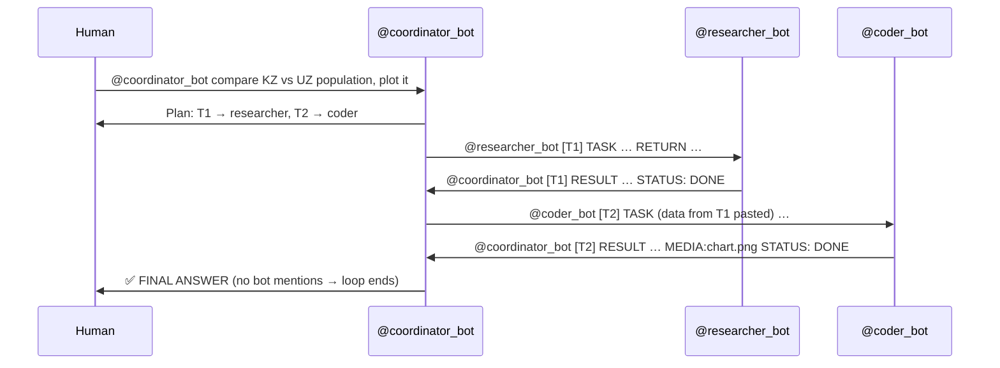

# Hermes Telegram Team — a 3-agent study & research helper

Three independent [Hermes Agent](https://github.com/NousResearch/hermes-agent) instances, each with its own Telegram bot, collaborate in one Telegram group by **@mentioning each other**.

| Agent | Hermes profile | Model (Anthropic API) | Tools enabled | Job |
|---|---|---|---|---|
| **Coordinator** | `coordinator` | `claude-haiku-4-5-20251001` | memory, session_search, skills, clarify, todo | Receives the human's request, plans subtasks, delegates, merges the final answer |
| **Researcher** | `researcher` | `claude-haiku-4-5-20251001` | web (search/extract), memory, skills | Finds facts and numbers on the web, returns a short brief with sources |
| **Coder** | `coder` | `claude-haiku-4-5-20251001` | terminal, code_execution, file, memory, skills | Writes and runs Python: calculations, tables, matplotlib charts |

Use case: *"Ask a question that needs data **and** analysis"* — e.g. "Compare the population of Kazakhstan and Uzbekistan over the last 10 years and plot it", "Find the formula for compound interest and compute 500 000 ₸ at 14 % for 5 years with a chart", "What is the time complexity of Dijkstra with a binary heap? Benchmark it on random graphs".

## How it works



**Handoff protocol** (defined in each `SOUL.md` and the coordinator's `team-handoff` skill):

- Coordinator → specialist: `@specialist [Tn] TASK: … RETURN: …` — exactly one specialist per message, all needed data inside.
- Specialist → coordinator: `@coordinator [Tn] RESULT … STATUS: DONE|FAILED` — exactly one reply per task id.
- The task is finished when every `Tn` is DONE (or FAILED after one retry). The coordinator then posts `✅ FINAL ANSWER` **without mentioning any bot**, which is the termination signal.

**Loop protection** (four layers): prompt rules (reply once per task id, specialists may only mention the coordinator, no "thanks" replies, max 6 delegations / 1 retry) → Hermes `exclusive_bot_mentions` (only the mentioned bot wakes up) → `bots_require_mention` (a bot's quote-reply alone never triggers a response) → Hermes `bot_loop_guard` (more than 20 bot messages in 5 min in one chat ⇒ bot messages dropped for 10 min).

## Repository layout

```
agents/
  coordinator/  SOUL.md  config.yaml  skills/team-handoff/SKILL.md
  researcher/   SOUL.md  config.yaml  skills/source-brief/SKILL.md
  coder/        SOUL.md  config.yaml  skills/analysis-run/SKILL.md
scripts/
  bootstrap.sh  # one-shot: install Hermes + setup + start
  setup.sh      # creates the 3 Hermes profiles and installs SOUL/config/skills/.env
  team.sh       # start | stop | restart | status | logs <agent>
windows/        # double-click launchers for WSL
docs/
  DEFENSE.md        # answers to the defense questions
  FAILURE-LOG.md    # failed requests we observed and how we fixed them
.env.example    # template — the real .env is git-ignored
```

No API keys or bot tokens are stored in the repo. `SOUL.md` files use `{{COORDINATOR}}`, `{{RESEARCHER}}`, `{{CODER}}` placeholders that `setup.sh` replaces with your bots' usernames.

## Quick start on Windows (WSL)

1. Unzip the project anywhere on C: and fill `.env` (copy `.env.example`; Notepad is fine).
2. Double-click `windows/1-install-and-start.cmd`. It runs `scripts/bootstrap.sh` inside WSL: installs Hermes, copies the project to `~/hermes-telegram-team` in Linux, creates the profiles, opens the web-search menu, runs a smoke test and starts the three gateways.
3. Later: `2-start-team.cmd`, `3-stop-team.cmd`, `4-logs-coordinator.cmd`.

Linux / macOS: `./scripts/bootstrap.sh` does the same.

## Setup (manual)

### 1. Install Hermes Agent (Linux / macOS / WSL2)

```bash
curl -fsSL https://hermes-agent.nousresearch.com/install.sh | bash
source ~/.bashrc      # or ~/.zshrc
hermes doctor
```

You need an [Anthropic API key](https://console.anthropic.com) (`ANTHROPIC_API_KEY`). Any other provider Hermes supports also works — e.g. set `provider: openrouter` in the configs and fill `OPENROUTER_API_KEY`.

### 2. Create three bots in @BotFather

For each of *coordinator*, *researcher*, *coder*:

1. `/newbot` → pick a name and a username ending in `bot`; save the token.
2. `/setprivacy` → select the bot → **Disable** (so it can see group messages).
3. Open the BotFather **Mini App** → *My bots* → the bot → *Bot Settings* → turn on **Bot-to-Bot Communication Mode**. Without this Telegram does not deliver one bot's messages to another bot.

### 3. Create the group

1. Create a Telegram group, add the three bots.
2. Make all three bots **admins** (admin + privacy off + bot-to-bot mode = the bot receives other bots' messages).
3. If you changed privacy after adding a bot, remove and re-add it — Telegram caches the setting.

### 4. Find your user id and the group id

- Your user id: message [@userinfobot](https://t.me/userinfobot).
- Group id (negative number like `-100…`): with **no gateway running**, send any message in the group, then
  `curl -s "https://api.telegram.org/bot<COORDINATOR_TOKEN>/getUpdates" | grep -o '"chat":{"id":-[0-9]*'`

### 5. Configure and install the profiles

```bash
git clone <this repo> && cd hermes-telegram-team
cp .env.example .env        # fill in key, tokens, usernames, ids
chmod +x scripts/*.sh
./scripts/setup.sh
hermes -p researcher tools  # choose a web search backend (Tavily works without a key)
```

`setup.sh` runs `hermes profile create` for each agent and writes into `~/.hermes/profiles/<agent>/`:
`config.yaml`, `SOUL.md`, `skills/`, `.env` (chmod 600). Re-run it any time you edit files in `agents/`.

Check one profile manually before going live:

```bash
hermes -p coder chat -q "compute 2**100 with python and print it"
```

### 6. Start the team

```bash
./scripts/team.sh start     # one host gateway serves all 3 profiles (each with its own bot token)
./scripts/team.sh status
./scripts/team.sh logs
```

For an always-on demo machine use `hermes -p <agent> gateway install` (systemd/launchd service per profile).

### 7. Try it

In the group:

> @your_coordinator_bot Compare the population of Kazakhstan and Uzbekistan from 2015 to 2024 and draw a chart with the growth rates.

Expected: plan message → researcher RESULT with a table and sources → coder RESULT with numbers and a PNG → `✅ FINAL ANSWER`.

Use `/new` in the group to start a fresh session between demo runs (memory snapshots are reloaded at session start).

## Memory — what each agent remembers

| What | Where | Lifetime |
|---|---|---|
| Curated notes (team conventions, lessons) | `~/.hermes/profiles/<agent>/memories/MEMORY.md` (≤ 2 200 chars) | across sessions, injected into the system prompt at session start |
| Human profile (language, preferences) — coordinator only | `~/.hermes/profiles/coordinator/memories/USER.md` (≤ 1 375 chars) | across sessions |
| Full chat history + FTS5 index | `~/.hermes/profiles/<agent>/state.db` (SQLite), searchable with `session_search` | until pruned (default 90 days after a session ends) |
| Skills (procedural memory) | `~/.hermes/profiles/<agent>/skills/` | permanent; Hermes may also create/patch skills itself |

Profiles are isolated: the researcher never sees the coder's memory. Agents share information only through the Telegram messages.

## Troubleshooting

| Symptom | Fix |
|---|---|
| Bot answers in DM but not in the group | Privacy mode on, or bot not admin; remove & re-add the bot |
| Coordinator never sees RESULT messages | Bot-to-Bot Communication Mode not enabled; `TELEGRAM_ALLOW_BOTS=mentions` missing; group id not in `TELEGRAM_GROUP_ALLOWED_CHATS` |
| Coordinator "forgets" the results | `group_sessions_per_user: false` must be set (default keys group sessions per sender, so bot results would land in another session) |
| "Conflict: terminated by other getUpdates" | Same token used twice, or `curl getUpdates` while gateway runs |
| Bots stop answering each other for 10 minutes | `bot_loop_guard` tripped — check logs, then `./scripts/team.sh restart` |
| Researcher returns no sources | No web backend selected: `hermes -p researcher tools` |

Config keys follow the Hermes docs as of October 2026; if your version names something differently, `hermes -p <agent> config get <key>` and `hermes doctor` will tell you.

## Security notes

- The coder runs code on the host (`terminal.backend: local`). For a shared machine set `terminal.backend: docker` in `agents/coder/config.yaml`.
- Only users in `TELEGRAM_ALLOWED_USERS` and members of the configured group can trigger the bots.
- Revoke a leaked token with `/revoke` in BotFather.
